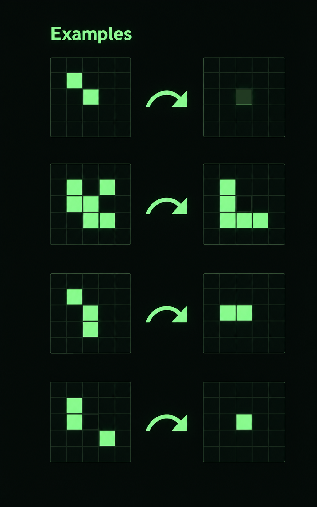

# Conway's Game of Life

A visually polished and high-performance implementation of Conway's Game of Life, built with Vanilla JavaScript and HTML5 Canvas.

## Overview

The Game of Life, also known as Conway's Game of Life or simply Life, is a cellular automaton devised by the British mathematician John Horton Conway in 1970. It is a zero-player game, meaning that its evolution is determined by its initial state, requiring no further input.

One interacts with the Game of Life by creating an initial configuration and observing how it evolves.

For more information, visit the [Wikipedia article](https://en.wikipedia.org/wiki/Conway%27s_Game_of_Life).

## Features

- **Interactive Grid:** Draw your own patterns directly on the canvas with mouse or touch.
- **Pattern Library:** Explore iconic structures like the Gosper Glider Gun, Pulsars, and the custom "The Power Set Pyramid".
- **Real-time Controls:** Adjust simulation speed and zoom level on the fly.
- **High Resolution:** Optimized for high DPI (Retina) displays for a crisp visual experience.
- **Mobile Responsive:** Fully playable on smartphones and tablets with an adaptive UI.

## The Rules

The universe of the Game of Life is an infinite, two-dimensional orthogonal grid of square cells, each of which is in one of two possible states, live or dead. Every cell interacts with its eight neighbours.

1.  **Underpopulation:** Any live cell with fewer than two live neighbours dies.
2.  **Survival:** Any live cell with two or three live neighbours lives on to the next generation.
3.  **Overpopulation:** Any live cell with more than three live neighbours dies.
4.  **Reproduction:** Any dead cell with exactly three live neighbours becomes a live cell.

## Development

This project was developed with a focus on clean, modular code and smooth user experience.

- **`game.js`**: Core engine, rendering logic, and event handling.
- **`patterns.js`**: Data for predefined patterns and educational descriptions.
- **`style.css`**: Modern, dark-themed UI with responsive layouts.

## License

This project is licensed under the MIT License - see the [LICENSE](LICENSE) file for details.
